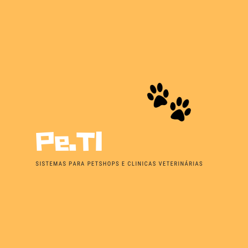

    

<h3 align="center">
    Pe.TI
</h3>

    
    
    
    

<h4 align="center">
	🚧 Development 🚧
</h4>

## 💻 Overview
Com o passar dos anos e mudanças de estilo de vida da população, tem sido observado um crescimento no mercado pet, estudos apontam que cada vez mais, é maior o número pessoas que moram sozinhas e que ficam mais tempo em casa, como resultado disso os animais se tornaram companheiros diários, sendo tratados como membros da família. No Brasil, de acordo com a Associação Brasileira da Indústria de Produtos para Animais de Estimação (Abinpet), existem mais de 140 milhões de animais de companhia, dos quais mais de 55 milhões são cães, 40 milhões são aves e quase 25 milhões de gatos. Há ainda 19,4 milhões de peixes ornamentais e 2,4 milhões de “outros animais”, categoria que engloba desde pequenos mamíferos, como hamsters, coelhos e porquinhos da Índia, até répteis e anfíbios.

A título de comparação, a estimativa populacional do Brasil é de 212,6 milhões habitantes, segundo dados do Banco Mundial (2020). Sendo a população de animais domésticos superior a 140 milhões, fica evidenciada a importância e participação dos pets nas famílias brasileiras. Essa característica traz impactos econômicos significativos, conforme informações do Instituto Pet Brasil, no ano de 2018, a indústria Pet movimentou US$ 124,6 bilhões, o que representou 0,36% do PIB brasileiro e colocou o país no patamar de 2º maior mercado pet do planeta, suplantado apenas pelos Estados Unidos.

Os números atualizados apontam que, apesar das dificuldades impostas pela pandemia, as famílias não deixam de cuidar de seu pet, mesmo que esse núcleo familiar seja composto apenas de uma pessoa que mora com um animal de estimação. Conforme levantamento do setor, o principal canal de acesso aos produtos são os Pet shops de pequenos e médios porte, juntos eles representam praticamente metade de todas as vendas do setor (48%). São ditos Pet Shop de Pequeno Porte ou Loja de Vizinhança aqueles que possuem até 4 funcionários e Pet Shop de Médio Porte aqueles que contam com 5 a 19 funcionários.

Sabe-se que as pequenas empresas geralmente não possuem sistema de informação para apoiar no controle dos principais dados e processos do negócio, assim, este projeto objetiva construir um sistema que registre e processe informações estratégicas para Pets Shops de Pequeno ou Médio Porte, tornando-os mais eficientes e organizados, podendo contribuir para melhorar a qualidade dos serviços prestados e aumentar os lucros do negócio.

---

## ✅ Steps
- [x] Descrição do projeto
    - [x] Detalhamento do problema e solução apresentada.
    - [x] Definição das classes e métodos que deverão ser desenvolvidos.
- [x] Desenvolver classes e seus atributos - iniciado
- [x] Implementar a interação com o usuário via linha de comando
- [x] Implementar a persistência de dados
- [x] Testes manuais do sistema
- [x] Gravar vídeo do funcionamento do sistema

Mini-Relatório do Projeto
21/11 - Definição das classes e dos métodos. Diagrama de Classes UML.
25/11 - Construção das Classes e métodos para Animal, Cachorro e Gato.
02/12 - Construção das Classes e metodos Pessoa, Funcionário, Agendamento, Venda e Serviço.
09/12 - Redução de escopo, definição de classes e métodos a serem entregues, revisão do diagrama de Classes UML.
18/12 - Testes do funcionamento mínimo do sistema e vídeo.

    
    <legend align="center">Diagrama UML</legend>

---

## ⚙️ How it works

...

## 🚀 Tech Stack

-   **[C#](https://docs.microsoft.com/pt-br/dotnet/csharp/)**

#### **Utilitários**

-   IDE:  **[Visual Studio](https://visualstudio.microsoft.com/pt-br/)**

---

## Authors
<table>
    <tr>
    <td align="center">
        

            <a href="#">
                
                 
                <b>Kassia Fraga</b></a>
             

 

        

    </td>
        <td align="center">
            

                <a href="#">
                    
                     
                    <b>Vanessa Machado</b></a>
                 

 

            

        </td>
    </tr>
</table>

---

## 📝 Licença

Este projeto esta sob a licença [MIT](./LICENSE).

## Link do Vídeo - Entrega Final ##
https://www.youtube.com/watch?v=5PbnUM84aCo